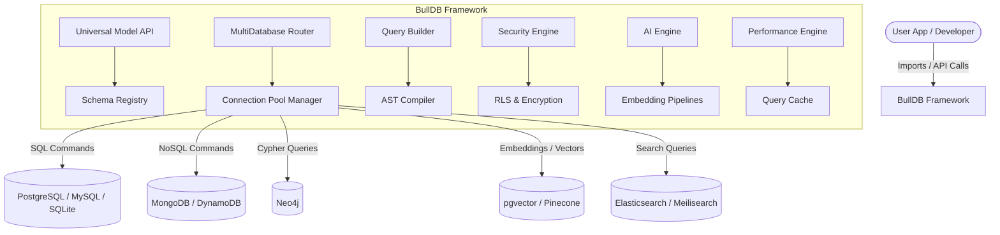
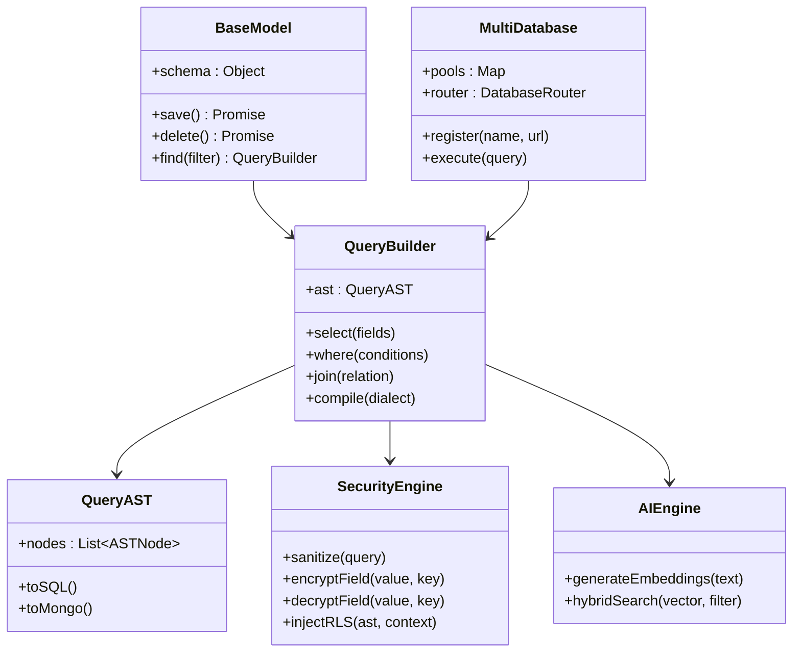
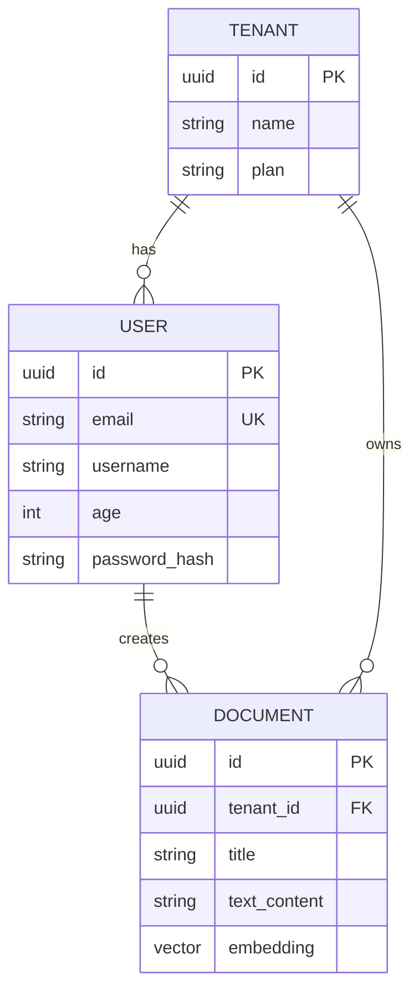
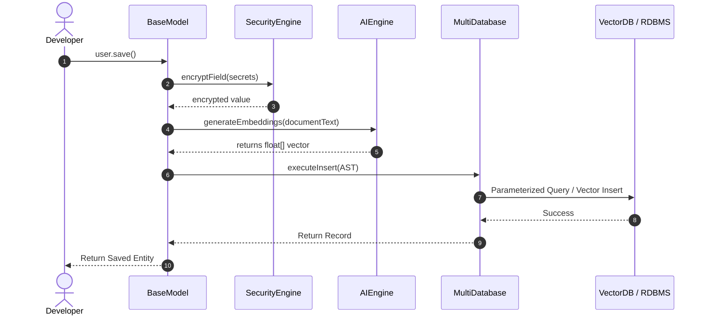
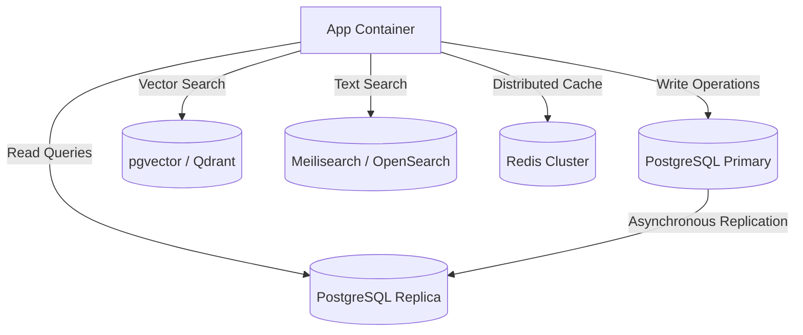

# BullDB Mermaid Diagrams

This document contains visual diagrams mapping out BullDB's systems, code structures, data flows, and deployments.

---

## 1. C4 Container Diagram

---

## 2. Component Class Diagram

---

## 3. ER Diagram (Federated Schema Example)

---

## 4. Sequence Diagram: Data Write and Auto-Embedding Flow

---

## 5. Deployment Topology

